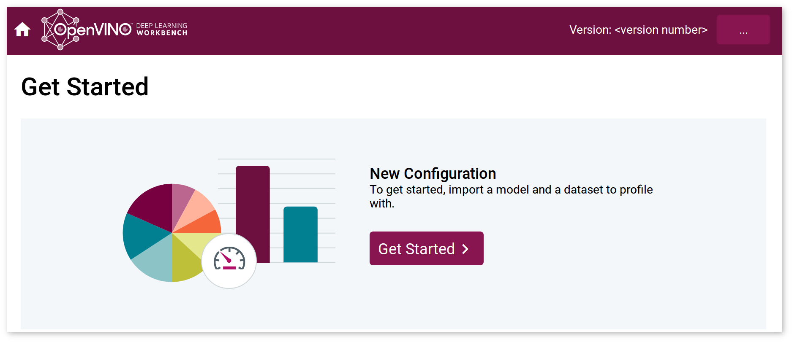

# Install DL Workbench

> **IMPORTANT**: See the [prerequisites to run the DL Workbench](https://docs.openvinotoolkit.org/latest/workbench_docs_Workbench_DG_Install_Workbench.html#prerequisites).

You can run the DL Workbench by building a Docker\* image locally. Refer to the section with the
instructions for your operating system:

* <a href="#linux">Install DL Workbench from Docker Hub* on Linux* OS</a>
* <a href="#windows">Install DL Workbench from Docker Hub* on Windows* OS</a>
* <a href="#macos">Install DL Workbench from Docker Hub* on macOS*</a>

For details about parameters, see <a href="#args">Parameter Explanation</a>.

These instructions help you install dependencies and run the DL Workbench through a Docker image on
Linux\*, Windows\*, and macOS\*. 

## <a name="linux">Install DL Workbench from Docker Hub* on Linux*</a>
### Install Docker* CE on Linux OS

To install Docker CE for Linux, follow the steps described in [Get Docker Engine - Community for
Ubuntu](https://docs.docker.com/install/). 

### Run Docker Container on Linux OS

> **NOTE**: The following sections contain instructions to run the DL Workbench with the
> dedicated script. If you prefer to use `docker run` instead, see 
> <a href="#docker-run">Run Docker Container with `docker run` Command</a>.

> **NOTE**: If you are behind corporate proxies, set them as described in <a href="#proxy-linux">Set Proxy</a>.

#### Pull the highest available Docker image of the DL Workbench

`docker pull openvino/workbench:latest`

#### Single-Line Start

Choose one of the options:
* Single-line command with GNU Wget:
```bash
wget https://raw.githubusercontent.com/openvinotoolkit/workbench_aux/master/start_workbench.sh && bash start_workbench.sh -IMAGE_NAME openvino/workbench -TAG latest
```

* Single-line command with cURL:
```bash
curl -o start_workbench.sh https://raw.githubusercontent.com/openvinotoolkit/workbench_aux/master/start_workbench.sh && bash start_workbench.sh -IMAGE_NAME openvino/workbench -TAG latest
```

> **NOTE**: Execution any of the above commands starts the DL Workbench in the interactive mode
> with CPU support only. Go to the <a href="#args">List of All Arguments</a> for other options.

#### Step-by-Step Start

1. Choose one of the options to download the script:
   * Download with GNU Wget:
   ```bash
   wget https://raw.githubusercontent.com/openvinotoolkit/workbench_aux/master/start_workbench.sh
   ```
   * Download with cURL:
   ```bash
   curl -o start_workbench.sh https://raw.githubusercontent.com/openvinotoolkit/workbench_aux/master/start_workbench.sh
   ```

2. Open a terminal in the directory with the downloaded script and run the following command to make
   the file executable:
```bash
chmod +x start_workbench.sh
```

3. Run the Docker container with the highest available version of the DL Workbench with the
   following command: 
```
./start_workbench.sh -IMAGE_NAME openvino/workbench -TAG latest
```

> **NOTE**: To see the list of available arguments in a terminal, run the following command:
> ```bash
> ./start_workbench.sh --help
> ```

#### <a name="args">List of All Arguments</a>   

| Argument| Explanation | Default Value|
|:----- | :----- | :----- |
| `--help`  |  Displays help message and exits the script.| N/A |
| `-IMAGE_NAME`  |  Specifies the DL Workbench Docker image name. Use `openvino/workbench` to get the highest version.| `openvino/workbench`|
| `-TAG`  | Specifies the DL Workbench Docker image tag name. Use it if you need a lower version of the DL Workbench.| `latest`|
| `-IP`  |  Specifies the IP on which to set up the DL Workbench. |`0.0.0.0`|
| `-PORT`  |  Maps the Docker container port `5665` to the provided host port to get access to the DL Workbench from a web browser. |`5665` |
| `-DETACHED`  | **Boolean.** Enables the detached mode of the Docker container. |`false`|
| `-CONTAINER_NAME`  | Specifies the container name to use. |`workbench`|
| `-RESTART`  | Restarts previously stopped DL Workbench container. |N/A|
| `-STOP`  | Stops DL Workbench container. |N/A|
| `-ENABLE_GPU`  | **Boolean.** Adds a host device to the container. Enables the container to use GPU devices in the DL Workbench. | `false` |
| `-ENABLE_MYRIAD` | **Boolean.** Mounts directory `/dev/bus/usb` to the Docker container and adds the rule with allowed devices list to the cgroup. Enables the container to use Intel® Neural Compute Stick 2 devices in the DL Workbench. *Cannot be used when running with Vision Accelerator Design with Intel® Movidius™ VPUs.*  | `false`|
| `-ENABLE_HDDL` | **Boolean.** Adds a host device to the container and mounts directory `/var/tmp` to the Docker container. Enables the container to use Vision Accelerator Design with Intel® Movidius™ VPUs in the DL Workbench. *Cannot be used when running with Intel® Neural Compute Stick 2.*| `false`|
| `-HTTP_PROXY`  | Specifies the HTTP proxy in the format `http://<user>:<password>@<proxy-host>:<proxy-port>`. |N/A|
| `-HTTPS_PROXY`  | Specifies the HTTPS proxy in the format `https://<user>:<password>@<proxy-host>:<proxy-port>`. |N/A|
| `-NO_PROXY`  |  Specifies the URLs that should be excluded from proxying in the format `url1,url2,url3`. |N/A|
| `-ASSETS_DIR`  | Mounts a provided local folder to the `/home/workbench/.workbench` directory in the Docker container. |N/A|
| `-SSL_CERT`  | Specifies the path to the DL Workbench web app TLS certificate in the DL Workbench configuration directory. | N/A|
| `-SSL_KEY`  | Specifies the path to the `SSL_CERT` certificate private key in the DL Workbench configuration directory. |N/A|
| `-SSL_VERIFY`  | Indicates whether the `SSL_CERT` TLS certificate is trusted (`on`), or either self-signed or untrusted (`off`).|`on`|
| `-ENABLE_AUTH`  | **Boolean.** Enables authentication settings for the DL Workbench.|`false`|
| `-DISABLE_JUPYTER`  | **Boolean.** Disables the Jupyter server.|`false`|

> **IMPORTANT**: Before using the `ASSETS_DIR` argument: <br>
> 1. Make sure the directory you pass as a value of `ASSETS_DIR` has read, write, and execute 
> permissions set for **all** users. See [Troubleshooting](https://docs.openvinotoolkit.org/latest/workbench_docs_Workbench_DG_Troubleshooting.html) for details.
> 2. Create a group called `workbench` and add the current user `<USERNAME>` to it. Use the commands below:  <br>
> ```
> sudo groupadd -g 5665 workbench
> ``` 
> ```
> sudo usermod -a -G 5665 <USERNAME>
>```

> **NOTES**: 
> * `-ENABLE_MYRIAD` and `-ENABLE_HDDL` cannot be set simultaneously because Intel® Neural
> Compute Stick 2 and Intel® Vision Accelerator Design with Intel® Movidius™ VPUs are incompatible
> and cannot be used in the DL Workbench together.
> 
> * For more information about `SSL_CERT, SSL_KEY, and SSL_VERIFY`, see 
> [configuring TLS in Docker container](https://docs.openvinotoolkit.org/latest/workbench_docs_Workbench_DG_Configure_TLS.html).
>
> * For more information about `RESTART` and `STOP`, see 
> [Docker Container](https://docs.openvinotoolkit.org/latest/workbench_docs_Workbench_DG_Docker_Container.html).

The parameter set depends on the targets you have on your machine. Choose the combination that suits
you and provide appropriate arguments in the starting script:

* <a href="#cpu">CPU</a>
* <a href="#cpu-gpu">CPU and Intel® Processor Graphics (GPU)</a>
* <a href="#cpu-ncs2">CPU and Intel® Neural Compute Stick 2</a>
* <a href="#cpu-hddl">CPU and Intel® Vision Accelerator Design with Intel® Movidius™ VPUs</a>
* <a href="#cpu-gpu-ncs2">CPU, GPU, and Intel® Neural Compute Stick 2</a>
* <a href="#cpu-gpu-hddl">CPU, GPU, and Intel® Vision Accelerator Design with Intel® Movidius™ VPUs</a>

> **NOTE**: To enable Intel® Vision Accelerator Design with Intel® Movidius™ VPUs in the DL
> Workbench, 
> [install the OpenVINO™ toolkit for Linux*](https://docs.openvinotoolkit.org/latest/openvino_docs_install_guides_installing_openvino_linux.html) 
> first. 

#### <a name="cpu">Run Docker Container on CPU</a>

Choose the container mode that works best for you and run the corresponding commands:

* Interactive mode – a Docker container allows interactive processes in the DL Workbench terminal:
```bash
./start_workbench.sh -IMAGE_NAME openvino/workbench
```
Once the http://127.0.0.1:5665 link followed by a generated token appears in the console log, open it in your browser. See [Enter DL Workbench](https://docs.openvinotoolkit.org/latest/workbench_docs_Workbench_DG_Authentication.html) for details. 

> **TIP**: To stop a container in the interactive mode, press *Ctrl + C*.

* Detached mode – a Docker container runs as a background process and does not receive input or display output:    

```bash
./start_workbench.sh -IMAGE_NAME openvino/workbench -DETACHED -ASSETS_DIR ~/.workbench
```    
Wait for the DL Workbench to set up for about a minute. Once it is done, open the http://127.0.0.1:5665 link and enter a token generated in the `~/.workbench` folder. 
See [Enter DL Workbench](https://docs.openvinotoolkit.org/latest/workbench_docs_Workbench_DG_Authentication.html) for details. 

> **NOTE**: To change the directory where the token is saved, replace `~/.workbench` with another
> directory.  

> **TIP**: To stop a container in this mode, run the `docker stop workbench` command.     
> To monitor logs in the detached mode, run `docker logs workbench`.

#### <a name="cpu-gpu">Run Docker Container on CPU and GPU</a>

Choose the container mode that works best for you and run the corresponding commands:

* Detached mode – a Docker container runs as a background process and does not receive input or display output:    
```bash
./start_workbench.sh -IMAGE_NAME openvino/workbench -ENABLE_GPU -DETACHED -ASSETS_DIR ~/.workbench
```   
Wait for the DL Workbench to set up for about a minute. Once it is done, open the http://127.0.0.1:5665 link and enter a token generated in the `~/.workbench` folder. See [Enter DL Workbench](https://docs.openvinotoolkit.org/latest/workbench_docs_Workbench_DG_Authentication.html) for details. 

> **NOTE**: To change the directory where the token is saved, replace `~/.workbench` with another
> directory. 

> **TIP**: To stop a container in this mode, run the `docker stop workbench` command.     
> To monitor logs in the detached mode, run `docker logs workbench`.

* Interactive mode – a Docker container allows interactive processes in the DL Workbench terminal:
```bash
./start_workbench.sh -IMAGE_NAME openvino/workbench -ENABLE_GPU
```
Once the http://127.0.0.1:5665 link followed by a generated token appears in the console log, open it in your browser. See [Enter DL Workbench](https://docs.openvinotoolkit.org/latest/workbench_docs_Workbench_DG_Authentication.html) for details. 

> **TIP**: To stop a container in the interactive mode, press *Ctrl + C*.

#### <a name="cpu-ncs2">Run Docker Container on CPU and Intel® Neural Compute Stick 2</a>

Choose the container mode that works best for you and run the corresponding commands:

* Interactive mode – a Docker container allows interactive processes in the DL Workbench terminal:
```bash
./start_workbench.sh -IMAGE_NAME openvino/workbench -ENABLE_MYRIAD
```
Once a link appears in the console log, point your browser to http://127.0.0.1:5665. 

> **TIP**: To stop a container in the interactive mode, press *Ctrl + C*.

* Detached mode – a Docker container runs as a background process and does not receive input or display output:    
```bash
./start_workbench.sh -IMAGE_NAME openvino/workbench -ENABLE_MYRIAD -DETACHED -ASSETS_DIR ~/.workbench
```  
Wait for the DL Workbench to set up for about a minute. Once it is done, open the http://127.0.0.1:5665 link and enter a token generated in the `~/.workbench` folder. See [Enter DL Workbench](https://docs.openvinotoolkit.org/latest/workbench_docs_Workbench_DG_Authentication.html) for details. 

> **NOTE**: To change the directory where the token is saved, replace `~/.workbench` with another
> directory.  

> **TIP**: To stop a container in this mode, run the `docker stop workbench` command.     
> To monitor logs in the detached mode, run `docker logs workbench`.

#### <a name="cpu-hddl">Run Docker Container on CPU and Intel® Vision Accelerator Design with Intel® Movidius™ VPUs</a>

**Step 1: Install OpenVINO™ Package**

Download the Intel® Distribution of OpenVINO™ toolkit for Linux* OS from the
[download page](https://software.seek.intel.com/openvino-toolkit) (registration required).

Follow the instructions to
[Install the Intel® Distribution of OpenVINO™ toolkit for Linux*](https://docs.openvinotoolkit.org/latest/openvino_docs_install_guides_installing_openvino_linux.html).

> **NOTE**: Do not remove the archive you used to install the OpenVINO™ toolkit
> package, because the archive is required for running the DL Workbench.

**Step 2: Set Up Dependencies for Intel® Vision Accelerator Design with Intel® Movidius™ VPUs**

Set up the environment on the host machine. It is required to execute `hddldaemon`, which is responsible for communication between the HDDL plugin and the board. To set up the environment, follow the [Configuration Guide for Intel® Vision Accelerator Design with Intel® Movidius™ VPUs](https://docs.openvinotoolkit.org/latest/openvino_docs_install_guides_installing_openvino_linux_ivad_vpu.html).

**Step 3: Run `hddldaemon`** 

In the terminal, run `hddldaemon` on the host machine with the following command:
```bash
${HDDL_INSTALL_DIR}/bin/hddldaemon
```

**Step 4: Run Docker Container**  

Choose the container mode that works best for you and run the corresponding commands in a separate terminal session:

* Interactive mode – a Docker container allows interactive processes in the DL Workbench terminal:
```bash
./start_workbench.sh -IMAGE_NAME openvino/workbench -ENABLE_HDDL
```
Once a link appears in the console log, point your browser to http://127.0.0.1:5665. 

> **TIP**: To stop a container in the interactive mode, press *Ctrl + C*.

* Detached mode – a Docker container runs as a background process and does not receive input or display output:    
```bash
./start_workbench.sh -IMAGE_NAME openvino/workbench -ENABLE_HDDL -DETACHED -ASSETS_DIR ~/.workbench
```    
Wait for the DL Workbench to set up for about a minute. Once it is done, open the http://127.0.0.1:5665 link and enter a token generated in the `~/.workbench` folder. See [Enter DL Workbench](https://docs.openvinotoolkit.org/latest/workbench_docs_Workbench_DG_Authentication.html) for details. 

> **NOTE**: To change the directory where the token is saved, replace `~/.workbench` with another
> directory.  

> **TIP**: To stop a container in this mode, run the `docker stop workbench` command.     
> To monitor logs in the detached mode, run `docker logs workbench`.

#### <a name="cpu-gpu-ncs2">Run Docker Container on CPU, GPU, and Intel® Neural Compute Stick 2</a>

Choose the container mode that works best for you and run the corresponding commands:

* Interactive mode – a Docker container allows interactive processes in the DL Workbench terminal:
```bash
./start_workbench.sh -IMAGE_NAME openvino/workbench -ENABLE_GPU -ENABLE_MYRIAD
```
Once a link appears in the console log, point your browser to http://127.0.0.1:5665. 

> **TIP**: To stop a container in the interactive mode, press *Ctrl + C*.

* Detached mode – a Docker container runs as a background process and does not receive input or display output:    
```bash
./start_workbench.sh -IMAGE_NAME openvino/workbench -ENABLE_GPU -ENABLE_MYRIAD -DETACHED -ASSETS_DIR ~/.workbench
```  
Wait for the DL Workbench to set up for about a minute. Once it is done, open the http://127.0.0.1:5665 link and enter a token generated in the `~/.workbench` folder. See [Enter DL Workbench](https://docs.openvinotoolkit.org/latest/workbench_docs_Workbench_DG_Authentication.html) for details. 

> **NOTE**: To change the directory where the token is saved, replace `~/.workbench` with another
> directory.  

> **TIP**: To stop a container in this mode, run the `docker stop workbench` command.     
> To monitor logs in the detached mode, run `docker logs workbench`.

#### <a name="cpu-gpu-hddl">Run Docker Container on CPU, GPU, and Intel® Vision Accelerator Design with Intel® Movidius™ VPUs</a>

**Step 1: Install OpenVINO™ Package**

Download the Intel® Distribution of OpenVINO™ toolkit for Linux* OS from the
[download page](https://software.seek.intel.com/openvino-toolkit) (registration required).

Follow the instructions to
[Install the Intel® Distribution of OpenVINO™ toolkit for Linux*](https://docs.openvinotoolkit.org/latest/openvino_docs_install_guides_installing_openvino_linux.html).

> **NOTE**: Do not remove the archive you used to install the OpenVINO™ toolkit
> package, because the archive is required for running the DL Workbench.

**Step 2: Set Up Dependencies for Intel® Vision Accelerator Design with Intel® Movidius™ VPUs**

Set up the environment on the host machine. It is required to execute `hddldaemon`, which is responsible for communication between the HDDL plugin and the board. To set up the environment, follow the [Configuration Guide for Intel® Vision Accelerator Design with Intel® Movidius™ VPUs](https://docs.openvinotoolkit.org/latest/openvino_docs_install_guides_installing_openvino_linux_ivad_vpu.html).

**Step 3: Run `hddldaemon`** 

In the terminal, run `hddldaemon` on the host machine with the following command:
```bash
${HDDL_INSTALL_DIR}/hddldaemon
```

**Step 4: Run Docker Container**  

Choose the container mode that works best for you and run the corresponding commands in a separate terminal session:

* Interactive mode – a Docker container allows interactive processes in the DL Workbench terminal:
```bash
./start_workbench.sh -IMAGE_NAME openvino/workbench -ENABLE_GPU -ENABLE_HDDL
```
Once a link appears in the console log, point your browser to http://127.0.0.1:5665. 

> **TIP**: To stop a container in the interactive mode, press *Ctrl + C*.
* Detached mode – a Docker container runs as a background process and does not receive input or display output:    
```bash
./start_workbench.sh -IMAGE_NAME openvino/workbench -ENABLE_GPU -ENABLE_HDDL -DETACHED -ASSETS_DIR ~/.workbench
```   
Wait for the DL Workbench to set up for about a minute. Once it is done, open the http://127.0.0.1:5665 link and enter a token generated in the `~/.workbench` folder. See [Enter DL Workbench](https://docs.openvinotoolkit.org/latest/workbench_docs_Workbench_DG_Authentication.html) for details. 

> **NOTE**: To change the directory where the token is saved, replace `~/.workbench` with another
> directory.  

> **TIP**: To stop a container in this mode, run the `docker stop workbench` command.     
> To monitor logs in the detached mode, run `docker logs workbench`.

You have successfully installed the OpenVINO™ DL Workbench. Move on to
[Work with Models and Sample Datasets](https://docs.openvinotoolkit.org/latest/workbench_docs_Workbench_DG_Work_with_Models_and_Sample_Datasets.html).

#### <a name="docker-run">Run Docker Container with `docker run` Command</a>

You can also run the DL Workbench docker container with the `docker run` command.

Below is the basic command that starts a Docker container with CPU support:
```bash
docker run -p 127.0.0.1:5665:5665 --name workbench -it openvino/workbench:latest
```

For more options, like enabling other devices or changing container settings, refer to
<a name="parameters">Parameters Table</a> or use the script.

### <a name="proxy-linux">Set Proxy: Linux OS (Optional)</a>

If you are behind a corporate proxy, set it by running the following commands:

1. Create a directory with a configurations file:   
```sh
mkdir -p /etc/systemd/system/docker.service.d
touch /etc/systemd/system/docker.service.d/http_proxy.conf
```

2. Write the data about proxy and DNS settings on your machine to the `http_proxy.conf` file. The
   contents of the file should look like this:
> **NOTE**: Replace the placeholders in the angle brackets with your proxy values.    
```ini
[Service]
Environment="HTTP_PROXY=<http-proxy>" "HTTPS_PROXY=<https-proxy>" "NO_PROXY=<no-proxy>"
```

3. Let the system reread configuration and restart the Docker\* container:        
``` sh
systemctl daemon-reload
systemctl restart docker
```

For details on customizing Docker settings, see [Control Docker with `systemd`](https://docs.docker.com/config/daemon/systemd/) 
or contact your system administrator.

Then run the Docker container with additional proxy parameters:

> **NOTE**: Replace `<no-proxy>`, `<http-proxy>`, and `<https-proxy>` with your proxy values.
```bash
./start_workbench.sh -IMAGE_NAME openvino/workbench -ENABLE_GPU -ENABLE_MYRIAD -HTTP_PROXY <http-proxy> -HTTPS_PROXY <https-proxy> -NO_PROXY <no-proxy>
```

For details on other parameters used in the command, see the previous section.

## <a name="windows"> Install DL Workbench on Windows* OS</a>

### Install Docker Desktop*

To install Docker Desktop for Windows OS, follow the steps described in the
[Install Docker Desktop on Windows](https://docs.docker.com/docker-for-windows/install/) (registration required). When the
installation is complete, start Docker Desktop.

### Run Docker Container on Windows OS

> **NOTE**: For this step, Docker Desktop must be running.

Choose the container mode that works best for you and run the corresponding commands in Windows PowerShell*:

> **NOTE**: If you are behind corporate proxies, set them as described in <a href="#proxy-windows">Set Proxy</a>.

* Interactive mode – a Docker container allows interactive processes in the DL Workbench terminal:
<pre><code>
docker run -p 127.0.0.1:5665:5665 `
           --name workbench `
           -it openvino/workbench:latest
</code></pre>
Once a link appears in the console log, point your browser to http://127.0.0.1:5665.

> **TIP**: To stop a container in the interactive mode, press *Ctrl + C*.

* Detached mode - a Docker container runs in the background of your terminal and does not receive input or display output:
```bash
mkdir C:\workbench
```

<pre><code>
docker run -p 127.0.0.1:5665:5665 `
           --name workbench `
           --volume /C/workbench:/home/workbench/.workbench `
           -d openvino/workbench:latest
</code></pre>
Wait for the DL Workbench to set up for about a minute. Once it is done, open the http://127.0.0.1:5665 link and enter a token generated in the `C:\workbench` folder. See [Enter DL Workbench](https://docs.openvinotoolkit.org/latest/_docs_Workbench_DG_Authentication.html) for details. 

> **TIP**: To stop a container in this mode, run the `docker stop workbench` command.     
> To monitor logs in the detached mode, run `docker logs workbench`.

When you open http://127.0.0.1:5665 in your browser, the
DL Workbench **Get Started** page appears:



You have successfully installed the OpenVINO™ DL Workbench. Move on to
[Work with Models and Sample Datasets](https://docs.openvinotoolkit.org/latest/workbench_docs_Workbench_DG_Work_with_Models_and_Sample_Datasets.html).


### <a name="proxy-windows">Set Proxy: Windows OS (Optional)</a>

If you are behind a corporate proxy, you can set it in the Docker Desktop settings
and in Windows PowerShell*.

To set proxy in the settings, right click on **Docker Desktop** in the taskbar items,
select **Configure proxy**, and follow the scheme below:

*Settings* >> *Proxies* >> Select *Manual proxy configuration* >> Add your http-proxy
to both *Web Server* and *Secure Web Server* >> *Apply settings*

*Settings* >> *Proxies* >> Add your no-proxy to *Bypass for these hosts ...* >> *Apply settings*


Now set proxy in Windows PowerShell by passing the following arguments:

```bash
$http_proxy="<your_http_proxy>"
```
```bash
$https_proxy="<your_https_proxy>"
```

> **NOTE**: Double quotes are required for these arguments.

Then run the Docker container with additional proxy parameters:  

> **NOTE**: Replace `<no-proxy>`, `<http-proxy>`, and `<https-proxy>` with your proxy values.   
<pre><code>
docker run -p 127.0.0.1:5665:5665 `
                --name workbench `
                -e no_proxy=<no-proxy> `
                -e http_proxy=<http-proxy> `
                -e https_proxy=<https-proxy> `
                -it openvino/workbench:latest
</code></pre>

For details on other parameters used in the command, see the previous section.

## <a name="macos">Install DL Workbench from Docker Hub* on macOS*</a>

### Install Docker CE on macOS

To install Docker Desktop for macOS, follow the steps described in the
[Install Docker Desktop on Mac](https://docs.docker.com/docker-for-mac/install/) (registration required). 
When the installation is complete, start Docker Desktop.

### Run Docker Container on macOS

Choose the container mode that works best for you and run the corresponding commands in a terminal:

> **NOTE**: If you are behind corporate proxies, set them as described in <a href="#proxy-macos">Set Proxy</a>.

* Interactive mode – a Docker container allows interactive processes in the DL Workbench terminal:
```bash
docker run -p 127.0.0.1:5665:5665 \
                --name workbench \
                -it openvino/workbench:latest
```
Once a link appears in the console log, point your browser to http://127.0.0.1:5665.

> **TIP**: To stop a container in this mode, press *Ctrl + C*.

* Detached mode - a Docker container runs in the background of your terminal and does not receive input or display output:
```bash
mkdir -p ~/.workbench
```
```bash
docker run -p 127.0.0.1:5665:5665 \
                --name workbench \
                --volume ~/.workbench:/home/workbench/.workbench
                -d openvino/workbench:latest
```
Wait for the DL Workbench to set up for about a minute. Once it is done, open the http://127.0.0.1:5665 link and enter a token generated in the `~/.workbench` folder. See [Enter DL Workbench](https://docs.openvinotoolkit.org/latest/_docs_Workbench_DG_Authentication.html) for details. 

> **TIP**: To stop a container in this mode, run the `docker stop workbench` command.     
> To monitor logs in the detached mode, run `docker logs workbench`.

When you open http://127.0.0.1:5665 in your browser, the
 DL Workbench **Get Started** page appears:


You have successfully installed the OpenVINO™ DL Workbench. Move on to
[Work with Models and Sample Datasets](https://docs.openvinotoolkit.org/latest/workbench_docs_Workbench_DG_Work_with_Models_and_Sample_Datasets.html).

### <a name="proxy-macos">Set Proxy: macOS (Optional)</a>

If you are behind a corporate proxy, follow the instructions from [Configure Docker to use a proxy server](https://docs.docker.com/network/proxy/#configure-the-docker-client),
run the Docker container with additional proxy parameters:  
> **NOTE**: Replace `<no-proxy>`, `<http-proxy>`, and `<https-proxy>` with your proxy values.
```bash
docker run -p 127.0.0.1:5665:5665 \
                --name workbench \
                -e no_proxy=<no-proxy> \
                -e http_proxy=<http-proxy> \
                -e https_proxy=<https-proxy> \
                -it openvino/workbench:latest
```
    
For details on other parameters used in the command, see the previous section.

## <a name="parameters">Parameter Explanation</a>

The command blocks above run Docker containers named `workbench` with the following arguments:   

| Argument| Explanation |
|:----- | :----- |
|  `-p 127.0.0.1:5665:5665`  |  Maps Docker container port `5665` to host port `5665` to get access to the DL Workbench from a web browser.  |
| `--device /dev/dri`  | Add a host device to the container. Enables the container to use GPU devices in the DL Workbench. |
| `-v /dev/bus/usb:/dev/bus/usb` | Mounts directory `/dev/bus/usb` to the Docker container. Enables the container to use Intel® Neural Compute Stick 2 devices in the DL Workbench. *Cannot be used when running with Vision Accelerator Design with Intel® Movidius™ VPUs.*  |
| `--device-cgroup-rule='c 189:* rmw'`  | Adds the rule with allowed devices list to the cgroup. Enables the container to use Intel® Neural Compute Stick 2 devices in the DL Workbench. *Cannot be used when running with Vision Accelerator Design with Intel® Movidius™ VPUs.* |
|`--device /dev/ion:/dev/ion` | Add a host device to the container. Enables the container to use Vision Accelerator Design with Intel® Movidius™ VPUs in the DL Workbench. *Cannot be used when running with Intel® Neural Compute Stick 2.*|
|`-v /var/tmp:/var/tmp`| Mounts directory `/var/tmp` to the Docker container. Enables the container to use Vision Accelerator Design with Intel® Movidius™ VPUs devices in the DL Workbench. *Cannot be used when running with Intel® Neural Compute Stick 2.*|
| `-it`  | Enables the interactive mode of the Docker container. Set to the Docker image name `workbench`. |
| `-d`  | Enables the detached mode of the Docker container. Set to the Docker image name `workbench`. |
|`--volume ~/.workbench:/home/workbench/.workbench`| Mounts a local folder named `~/.workbench` to the `/home/openvino/.workbench` directory in the Docker\* container|
|` -e https_proxy=<https-proxy>`<br><br>`-e http_proxy=<http-proxy>`<br><br> `-e no_proxy=<no-proxy>`  |  Optional. If you are behind a corporate proxy, set environment variables.| 
